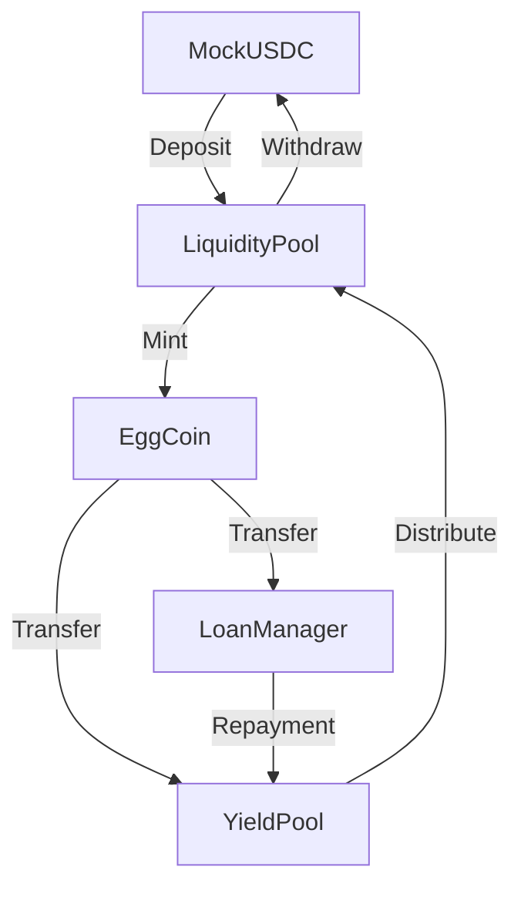

# EggCoin DApp - Agricultural Lending Protocol


A decentralized lending protocol connecting poultry farmers with investors using blockchain technology.

## Table of Contents
- [Overview](#overview)
- [Architecture](#architecture)
- [Technologies](#technologies)
- [Smart Contracts](#smart-contracts)
- [Frontend](#frontend)
- [Deployment](#deployment)
- [Getting Started](#getting-started)

## Overview

EggCoin is a stablecoin-backed lending protocol that:
- Allows farmers to secure loans using egg production as collateral
- Enables investors to earn yield by providing liquidity
- Uses EggCoin (1:1 pegged to USDC) as the medium of exchange

## Architecture



### Key Components

1. **EggCoin (ERC20)**
   - Protocol stablecoin
   - Minted 1:1 with USDC deposits
   - Used for loans and repayments

2. **LiquidityPool**
   - Accepts USDC deposits
   - Mints/burns EggCoin
   - Tracks investor balances

3. **LoanManager**
   - Manages farmer loans
   - Processes loan requests
   - Tracks repayments with 5% interest

4. **YieldPool**
   - Collects loan interest
   - Distributes yield to investors
   - Calculates shares proportionally

## Technologies

### Smart Contracts
- **Framework**: Hardhat
- **Language**: Solidity
- **Libraries**: OpenZeppelin Contracts
- **Testing**: Hardhat Network
- **Deployment**: Base Sepolia Testnet

### Frontend
- **Framework**: Next.js 15
- **Language**: TypeScript
- **Wallet Integration**: MetaMask, ethers.js, viem
- **UI**: React 18, CSS Modules

## Smart Contracts

| Contract | Address |
|----------|---------|
| MockUSDC | [0x76CB...593B](https://explorer.base.org/address/0x76CBb757d25ee75876B894079463D5973e9d593B) |
| EggCoin | [0xCd22...e251](https://explorer.base.org/address/0xCd22e18D0605a6843Fd74F11D02b7622D5Dfe251) |
| LiquidityPool | [0x1A78...0378](https://explorer.base.org/address/0x1A7879934f5106Cef3FDc0eF432A565911f10378) |
| LoanManager | [0x653b...F80e](https://explorer.base.org/address/0x653bb152d1B3fF6641f5f50F021686CCf1D8F80e) |
| YieldPool | [0xB0b0...DB20](https://explorer.base.org/address/0xB0b0768B68189aF86d93C150881002a21b35dB20) |

## Frontend Structure

```
frontend/
├── app/                 # Next.js app router
│   ├── farmer/          # Farmer dashboard
│   ├── investor/        # Investor dashboard
│   ├── vendor/          # Vendor dashboard
│   └── layout.tsx       # Shared layout
├── src/
│   ├── components/      # React components
│   ├── contracts/       # Contract ABIs
│   ├── utils/           # Utility functions
│   └── config/          # Wallet/config
```

## Deployment

### Smart Contracts
1. Set up `.env` with:
   - `PRIVATE_KEY`
   - `BASESCAN_API_KEY`
   - `ALCHEMY_API_KEY`

2. Run deployment:
```bash
cd backend
npx hardhat run scripts/deploy.js --network baseSepolia
```

### Frontend
1. Set up `.env.local` with:
   - `NEXT_PUBLIC_CONTRACT_ADDRESSES`
   - `NEXT_PUBLIC_RPC_URL`

2. Deploy to Vercel:
```bash
cd frontend
vercel --prod
```

## Getting Started

1. Clone the repository
2. Install dependencies:
```bash
cd backend && npm install
cd ../frontend && npm install
```
3. Start development servers:
```bash
# Backend (in separate terminal)
cd backend && npx hardhat node

# Frontend
cd frontend && npm run dev
