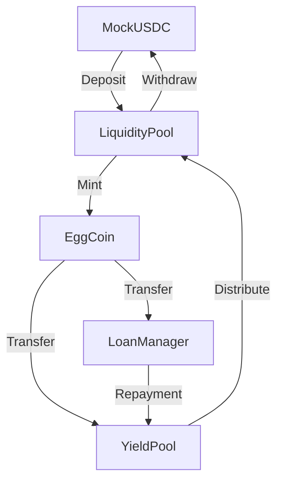

# EggCoin Protocol Architecture

## Contract Interactions

## Key Contracts

### 1. EggCoin (ERC20)
- The protocol's stablecoin
- Minted when USDC is deposited
- Burned when USDC is withdrawn
- Used for loans and repayments

### 2. LiquidityPool
- Accepts USDC deposits from investors
- Mints/burns EggCoin 1:1 with USDC
- Tracks investor balances
- Processes withdrawals

### 3. LoanManager
- Manages farmer loans
- Requires egg production logs
- Approves/denies loan requests
- Tracks repayments with interest

### 4. YieldPool
- Collects interest from loan repayments
- Distributes yield to investors
- Calculates shares based on stake

## Workflows

### Investor Deposit
1. Investor approves USDC transfer
2. Investor deposits USDC to LiquidityPool
3. LiquidityPool mints equivalent EggCoin

### Farmer Loan
1. Farmer registers and logs egg production
2. Farmer requests loan in EggCoin
3. LoanManager approves and transfers funds
4. Farmer repays with 5% interest

### Yield Distribution
1. Interest goes to YieldPool
2. Investors claim proportional yield
3. YieldPool mints new EggCoin to investors
